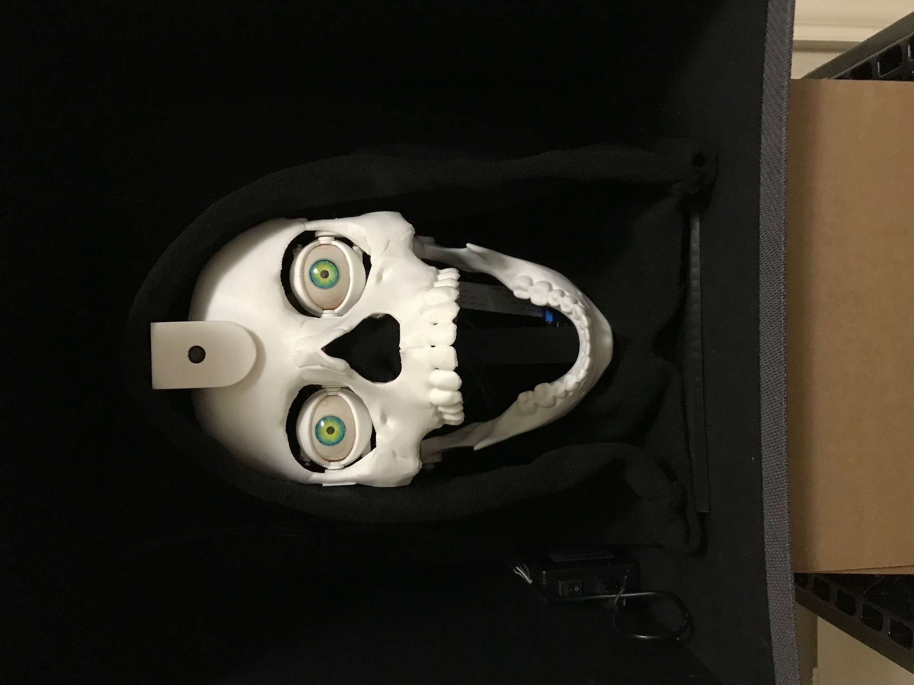

# Anamatronic Halloween Skull

The eyes in this 3D-printed Halloween project track the movement of faces visible to the Raspberry Pi camera mounted in the forehead.  Eyelid and jaw motions are also controlled with servos to create various expressions (asleep, surprised, talking, etc.) based on the proximity of the person's face.  A small speaker set is attached to the Raspberry Pi to play audio files to go with the expressions.  This is the second of two designs.  In this design, the eyes can be moved independently of each other, whereas the left and right eyelids are limited to moving together.

The eyes are based on this Nilheim Mechatronics project:
http://www.nilheim.co.uk/latest-projects-and-blog/simplified-3d-printed-animatronic-dual-eye-mechanism

The 3D printed skull face was adapted from this Thingiverse project:
https://www.thingiverse.com/thing:4830026

Face detection with Open CV is based on this PyImageSearch tutorial:
https://pyimagesearch.com/2018/02/26/face-detection-with-opencv-and-deep-learning/